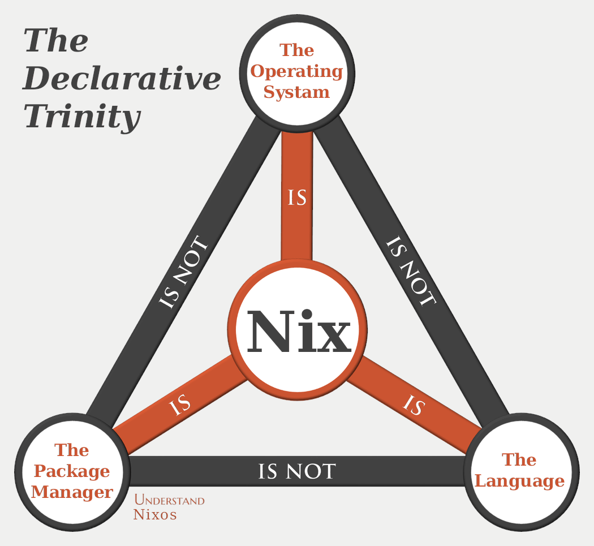

# Nix: from zero to something

{ width=40\% }

---

## Table of Contents

1. Disclaimer
2. Use Cases (to Grab Your Attention)
3. Nix Language
4. Derivations
5. The Nix Store
6. Flakes (short intro)
7. Killer Use Cases

# Disclaimer

>- I'm not sure this approach/TOC works
>- This demo is "from first principles", it might sound slow
>- I'm not an expert
>- If anything is not clear, please interrupt me
>- This starts from a fork: <https://github.com/aciceri/nixos-devops-talk>
>- Yes, you can use Nix in MacOS and WSL2: <https://nixos.org/download/>

# Some use cases

>- Build this presentation: `nix build .\#mkPresentation`
>- Contribute on projects without polluting system with project-specific tooling: [awesome-italia-opensource](https://github.com/albertodvp/awesome-italia-opensource?tab=readme-ov-file)
>- [Nixos configuration](https://github.com/albertodvp/nixos-dotfiles)

# Nix as a Language (1/3)

>- **declarative**: There is no notion of executing sequential steps.
Dependencies between operations are established only through data.
>- **pure**: Values cannot change during computation.
Functions always produce the same output if their input does not change.

## Nix as a Language (2/3)

>- **functional**: Functions are like any other value.
Functions can be assigned to names, taken as arguments, or returned by functions.
>- **lazy**: Values are only computed when they are needed.

## Nix as a Language (3/3)
>
>- **dynamically typed**: Type errors are only detected when expressions are evaluated.

---

Before we dive into derivations, let's cover some key language features
that are essential for understanding Nix expressions.

---

## Attribute Sets

   Attribute sets are like dictionaries or key-value pairs.
They're defined using curly braces:

   ```nix
   { 
     name = "example";
     value = 42;
   }
   ```

---

## Let Expressions

   `let` bindings allow you to create local variables:

   ```nix
   let 
     x = 1;
     y = 2;
   in
     x + y  # Returns 3
   ```

## With Expressions

   `with` brings an attribute set's attributes into scope:

   ```nix
   let set = { a = 1; b = 2; };
   in with set; a + b  # Returns 3
   ```

## Function Application

   Functions are called by putting the argument after the function,
  separated by a space:

   ```nix
   isNull null  # Returns true
   ```

## Function Definition

   Functions are defined using a colon. The syntax is `argument: body`

   ```nix
   x: x + 1  # A function that takes x and returns x + 1
   ```

   Functions can also take attribute sets as arguments

   ```nix
   { a, b }: a + b  # A function that takes an attrset with 'a' and 'b' keys
   ```

## Function Arguments with Defaults

   In Nix, function arguments can have default values. If an argument is not
  provided during the function call, the default value is used.

   ```nix
   { x ? 10 }: x + 5  # A function with a default value for x
   ```

   Calling this function with no arguments will return `15` because `x`
  defaults to `10`.

## Function Application (user defined function)

   ```nix
   (x: x + 1) 5  # Returns 6
   ```

   For functions taking attribute sets:

   ```nix
   ({ a, b }: a + b) { a = 1; b = 2; }  # Returns 3
   ```

## Import

   The `import` function is used to load Nix expressions from files or other
  sources. It can be used to import files directly or to pull in the
  Nix Packages collection (nixpkgs).

   ```nix
   let
     myModule = import ./path/to/module.nix;
   in
     myModule.someAttribute
   ```

## Importing `nixpkgs`

   The expression `<nixpkgs>` is a shorthand to refer to the Nix Packages
  collection (it's a path, depends on how you installed nix)

   ```nix
   let
     pkgs = import <nixpkgs> {};
   in
     pkgs.hello  # Refers to the 'hello' package from nixpkgs
   ```

If `nixpkgs` "points to master", it's literally [this](https://github.com/NixOS/nixpkgs/blob/master/pkgs/by-name/he/hello/package.nix)

## Using Import with Default Arguments

   ```nix
   { pkgs ? import <nixpkgs> {} }: 
   pkgs.hello
   ```

  Useful to override the pkgs (e.g. pin to a specific version,
  different from the default one)

--
>
>- Ok, now what? We use the **nix language** _mostly_ to produce *derivations*

# Derivations

The core building block that describes how to build a software component.
It's a low-level, immutable representation of a build process, which tells Nix exactly
what to do to produce a specific output.

**TL;DR: a derivation is a build plan.**

## A very simple derivation

```nix
# simple.nix
{ pkgs ? import <nixpkgs> { } }:
pkgs.stdenv.mkDerivation {
  name = "simple";
  src = ./.;
  installPhase = ''
    mkdir $out
    echo "42" > $out/output
  '';
}
```

---

## Store derivation

A `derivation` can be instantiated, it became a **store derivation**

To build this derivation, you would use the command:

```bash
nix-instantiate simple.nix
```

```text

...
this derivation will be built:
  /nix/store/{SOME-HASH}-simple.drv
...

```

---

We can navigate inspect a derivation:

```bash
nix derivation show   /nix/store/{SOME-HASH}-simple.drv
```

## The `.drv` File (1/2)

A `.drv` file contains:

- **Build Instructions**: How to fetch, unpack, build, and install the package.
- **Dependencies**: The dependencies required for the build, including other
packages and build tools.

## The `.drv` File (2/2)

- **Source Information**: Where to find the source code or files needed for
the build.
- **Phases**: Various build phases like `unpackPhase`, `patchPhase`, `buildPhase`,
`installPhase`, etc;
- **Output Paths**: Paths where the build outputs are placed in the Nix store.
- ... other "less interesting" things.

## Store Derivation Path

```bash
/nix/store/<hash>-<name>
```

The `hash` in the path is generated from the various inputs that make up the derivation.
This ensures determinism, meaning that if all inputs remain unchanged, the resulting derivation
will always produce the same hash and store path.

--

This approach is highly powerful, as it enables the use of caches and substitutes,
allowing pre-built derivations to be shared and reused, significantly improving build efficiency.

## Derivation realisation

nix-store --realise /nix/store/{SOME-HASH}-simple.drv

```bash
/nix/store/<hash>-<name>
```

## Shortcut & Summary: nix-build

`nix-build` does:

- Instantiation: The .nix file is instantiated into a store derivation (.drv).
- Realization: The .drv is then realized into the actual build output, based on its defined outputs
  (e.g., outputs.out.path).
- A symbolic link ~./result~ is created, pointing to the path of the realized output.

## Note

- **nix-build vs nix build**:
  - `nix-build` is the older command used to build Nix expressions directly
  from files.
  - `nix build` is a newer command that is more compatible with flakes and newer
  Nix features. It's recommended to use `nix build` if you're working with flakes
  or modern Nix expressions, as it integrates better with the new ecosystem.

## Let's Play with Our Derivation

---

Here's an example of a simple derivation that compiles a C program:

```nix
# hello.nix
{ pkgs ? import <nixpkgs> { } }:
pkgs.stdenv.mkDerivation {
  name = "hello";
  src = ./src;

  buildPhase = ''
    rustc $src/rust.rs -o ./hello
  '';
  installPhase = ''
    mkdir -p $out/bin
    cp ./hello $out/bin
  '';
}
```

---

## What are `$src` and `$out`?

- **`$src`**: This variable refers to the source code directory specified by the `src` attribute.
 In this example, it's the `./src` directory.
- **`$out`**: This variable represents the output directory in the Nix store where
the build results will be placed. Nix automatically sets this variable to a unique
path in the `/nix/store`.

---

If the derivation depends on other derivations, these are built first.

---

## Building the Derivation (from nixpkgs)

Nixpkgs is a vast repository that contains derivations for most of the software packages
 you might need. It's the primary package collection used by Nix and NixOS, offering a wide
variety of software from simple utilities to complex applications.
Each package in nixpkgs is represented by a derivation, which defines how the package
is built and configured.

---

For example, the Umoria package in nixpkgs can be examined and built with the following commands:

```bash
nix derivation show nixpkgs#sl
nix build nixpkgs#sl -L --rebuild

```

# Nix Store

{ width=40\% }

## Nix Store

Its primary purpose is to store both the derivation files (`.drv`) and their output artifacts.

- **Location**: The Nix store is located at `/nix/store`.
- **Immutability**: Once a derivation is built and stored in the Nix store, it never changes.
- **Accessibility**: The store is readable by all users, allowing for shared access.

# Caches

Before Nix `realise` a derivation, it checks the cache to see if the output already exists.
If it does, Nix can download the output directly from the cache instead of rebuilding it.

---

{ width=40\% }

# NixOS

What if the entire operating system was the output of a derivation?
NixOS is a basically a big configuration file (`.nix`) that _evaluates_ to a a big derivation that
build a Linux disto (plus some symbolic links that enables easy rollbacks).

## What Are Flakes?

{ width=60\% }

## What Are Flakes?

>- introduce more structured and reliable way to manage Nix projects
>- are an experimental feature
>- are expected to become the standard in future versions of Nix

# How this relate to notious

- nix-shell: spawn a shell with all tooling in the path
- home-manager

# Killer Use Uses

## Dev Shells

>- **Easier Onboarding**: New developers quickly get up and running with a nix-shell that configures
all tools and dependencies automatically, eliminating setup hassles.
>- **Consistent Environment**: Ensures all team members use the same development environment,
preventing discrepancies and conflicts.

## Reproducible Builds

>- **Consistent Builds**: Guarantees that builds are identical across different machines,
eliminating “it works on my machine” issues.
>- **Stable CI Pipelines**: CI systems benefit from reproducible builds as they ensure that builds
are consistent and reliable, leading to more accurate testing and integration results.
>- **Efficient Caching**: Reproducible builds enable the use of caching mechanisms to speed up
development.
