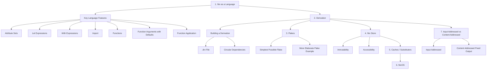

# Nix: from zero to something



## Disclaimer

- "But I can do `x` with `y` too!"
- My approach with Nix is orthodox, but partial integration is possible
- Many personal opinions
- I'll sacrifice some precision for better digestibility
- This starts from a fork: <https://github.com/aciceri/nixos-devops-talk>


## Nix as a Language

Before we dive into derivations, let's cover some key language features
that are essential for understanding Nix expressions and flakes.

### Key Language Features

1. **Attribute Sets**:
   Attribute sets are like dictionaries or key-value pairs.
They're defined using curly braces:

   ```nix
   { 
     name = "example";
     value = 42;
   }
   ```

2. **Let Expressions**:
   `let` bindings allow you to create local variables:

   ```nix
   let 
     x = 1;
     y = 2;
   in
     x + y  # Returns 3
   ```

3. **With Expressions**:
   `with` brings an attribute set's attributes into scope:

   ```nix
   let set = { a = 1; b = 2; };
   in with set; a + b  # Returns 3
   ```

4. **Import**:
   The `import` function is used to load Nix expressions from files or other
  sources. It can be used to import files directly or to pull in the
  Nix Packages collection (nixpkgs).

   - **Importing a local file**:

     ```nix
     let
       myModule = import ./path/to/module.nix;
     in
       myModule.someAttribute
     ```

   - **Importing `nixpkgs`**:
     The expression `<nixpkgs>` is a shorthand to refer to the Nix Packages
    collection. It is often used to import the entire package set.

     ```nix
     let
       pkgs = import <nixpkgs> {};
     in
       pkgs.hello  # Refers to the 'hello' package from nixpkgs
     ```

5. **Functions**:
   Functions are defined using a colon. The syntax is `argument: body`:

   ```nix
   x: x + 1  # A function that takes x and returns x + 1
   ```

   Functions can also take attribute sets as arguments:

   ```nix
   { a, b }: a + b  # A function that takes an attrset with 'a' and 'b' keys
   ```

6. **Function Arguments with Defaults**:
   In Nix, function arguments can have default values. If an argument is not
  provided during the function call, the default value is used.

   - **Simple Example**:

     ```nix
     { x ? 10 }: x + 5  # A function with a default value for x
     ```

     Calling this function with no arguments will return `15` because `x`
    defaults to `10`.

   - **Using Import with Default Arguments**:

     ```nix
     { pkgs ? import <nixpkgs> {} }: 
     pkgs.hello
     ```

     Here, `pkgs` defaults to the result of importing `nixpkgs`.
    If `pkgs` is not provided when calling the function,
    the function will use the default package set from `nixpkgs`.

7. **Function Application**:
   Functions are called by putting the argument after the function,
  separated by a space:

   ```nix
   (x: x + 1) 5  # Returns 6
   ```

   For functions taking attribute sets:

   ```nix
   ({ a, b }: a + b) { a = 1; b = 2; }  # Returns 3
   ```

### Building a Derivation

Now that we've covered the basics, let's look at how to build a derivation.
A derivation is essentially a build recipe in Nix.

## Derivation

The simplest derivation we can build:

```nix
# simplest.nix
{ pkgs ? import <nixpkgs> { } }:
pkgs.stdenv.mkDerivation {
  name = "";
  src = ./.;
  installPhase = ''
    mkdir $out
  '';
}
```

To build this derivation, you would use the command:

```bash
nix-build simplest.nix
```

### NOTE

- **nix-build vs nix build**:
  - `nix-build` is the older command used to build Nix expressions directly
  from files.
  - `nix build` is a newer command that is more compatible with flakes and newer
  Nix features. It's recommended to use `nix build` if you're working with flakes
  or modern Nix expressions, as it integrates better with the new ecosystem.

- **Viewing Derivation Details**:
  - You can inspect the details of a derivation using the `nix derivation show`
  command, which shows the output paths and the phases involved in the build
  process.

### The `.drv` File

A `.drv` file contains:

- **Build Instructions**: How to fetch, unpack, build, and install the package.
- **Dependencies**: The dependencies required for the build, including other
packages and build tools.
- **Source Information**: Where to find the source code or files needed for
the build.
- **Phases**: Various build phases like `unpackPhase`, `patchPhase`, `buildPhase`,
`installPhase`, etc.
- **Environment Variables**: Settings and environment variables required during
the build process.
- **Output Paths**: Paths where the build outputs are placed in the Nix store.

### What About Circular Dependencies?

TODO

### Let's Play with Our Derivation

Here's an example of a simple derivation that compiles a C program:

```nix
pkgs.stdenv.mkDerivation {
  name = "hello";

  src = ./src;

  buildInputs = [ coreutils gcc ];

  buildPhase = ''
    gcc "$src/hello.c" -o ./hello
  '';

  installPhase = ''
    mkdir -p "$out/bin"
    cp ./hello "$out/bin/"
  '';
}
```

- **What are `$src` and `$out`?**
  - **`$src`**: This variable refers to the source code directory specified by the `src` attribute.
   In this example, it's the `./src` directory.
  - **`$out`**: This variable represents the output directory in the Nix store where
  the build results will be placed. Nix automatically sets this variable to a unique
  path in the `/nix/store`.

This derivation will compile the `hello.c` file found in the `src` directory and place the
resulting binary in the Nix store under the `bin` directory.

The `.drv` file contains all the information necessary to build the derivation's output.

If the derivation depends on other derivations, these are built first.

Sure, here’s the completion of your presentation with the requested TODOs filled in:

---

## Building the Derivation (from nixpkgs)

Nixpkgs is a vast repository that contains derivations for most of the software packages
 you might need. It's the primary package collection used by Nix and NixOS, offering a wide
variety of software from simple utilities to complex applications.
Each package in nixpkgs is represented by a derivation, which defines how the package
is built and configured.

For example, the Umoria package in nixpkgs can be examined and built with the following commands:

```bash
nix derivation show nixpkgs#umoria
nix build nixpkgs#umoria -L --rebuild
```

These commands respectively show the derivation details for Umoria and then build it, potentially
downloading and rebuilding the package if necessary.

## Nix Store

The Nix store is a crucial component of the Nix package manager. Its primary purpose is to store
both the derivation files (`.drv`) and their output artifacts. These outputs are stored in a
deterministic manner, meaning that the same input will always produce the same output path.

- **Location**: The Nix store is located at `/nix/store`.
- **Immutability**: Once a derivation is built and stored in the Nix store, it never changes.
This ensures reproducibility and reliability.
- **Accessibility**: The store is readable by all users, allowing for shared access to built
packages.

Where do derivation outputs go? Each output is stored in a unique directory in the Nix store,
identified by a hash that represents the input derivations and their configurations.


## Caches

Caches (or **substituters**) play a vital role in speeding up the build process in Nix. Before Nix
builds a derivation, it checks the cache to see if the output already exists. If it does, Nix can
download the output directly from the cache instead of rebuilding it.

- **Purpose**: Caches are used to avoid redundant builds by reusing previously built derivations.
This makes the build process faster and more efficient.
- **Input Addressed**: The Nix build system typically generates outputs based on the inputs' hashes.
 This means that identical inputs will always produce identical outputs, which can be safely cached
 and reused.


## NixOS

NixOS takes the concept of reproducibility to the entire operating system level. What if the entire
 operating system was the output of a derivation? This is the idea behind NixOS, where everything
from the kernel to user applications is managed by Nix, ensuring that the system is fully
reproducible and easily configurable.

## Flakes


### TODO: What Are Flakes?

Flakes are an experimental feature in Nix that introduces a more structured and reliable way to
manage Nix projects. They enforce purity by restricting access to paths outside the Nix store,
making builds more reproducible. Flakes provide a standard way to declare dependencies and interact
with them, and they are expected to become the standard in future versions of Nix.

### Simplest Possible Flake

Let's build the simplest possible flake:

```nix
{
  description = "A simple example flake";

  # Defines the checks run by `nix flake check`
  checks = {
    default = {
      # A dummy check that always passes
      inherit self;
    };
  };

  # Defines the packages that can be built with `nix build .#default`
  packages = {
    default = derivation {
      name = "example";
      builder = "bash";
      args = [ "-c" "echo Hello, World!" ];
    };
  };
}
```

### More Elaborate Flake Example

Here’s a more elaborate flake example with comments:

```nix
{
  description = "An advanced example flake";

  # Dependencies and inputs for the flake
  inputs = {
    nixpkgs.url = "github:NixOS/nixpkgs";
  };

  outputs = { self, nixpkgs, ... }:
  {
    # Checks that are run with `nix flake check`
    checks.x86_64-linux.hello = nixpkgs.lib.mkDerivation {
      pname = "hello";
      version = "2.10";
      src = self;
      buildInputs = [ nixpkgs.hello ];
    };

    # A package that can be built with `nix build .#hello`
    packages.x86_64-linux.hello = nixpkgs.lib.mkDerivation {
      pname = "hello";
      version = "2.10";
      src = self;
      buildInputs = [ nixpkgs.hello ];
    };

    # An app that can be run with `nix run .#hello`
    apps.x86_64-linux.hello = {
      type = "app";
      program = "${self.packages.x86_64-linux.hello}/bin/hello";
    };
  };
}
```

In this example:

- **Inputs**: The `inputs` section specifies external dependencies, like nixpkgs.
- **Outputs**: The `outputs` section defines checks, packages, and apps that are part of the flake.
 These are built and run using the corresponding Nix commands.

## Ok, Now What?

Once you've understood the basics, you can start using Nix and flakes in your own projects.
Here are some steps to get you started:

- **Experiment**: Try writing simple derivations and flakes to get a feel for how they work.
- **Explore nixpkgs**: Dive into the nixpkgs repository to see how real-world software is packaged.
- **Contribute**: Consider contributing to nixpkgs or building your own packages to share with the
community.
